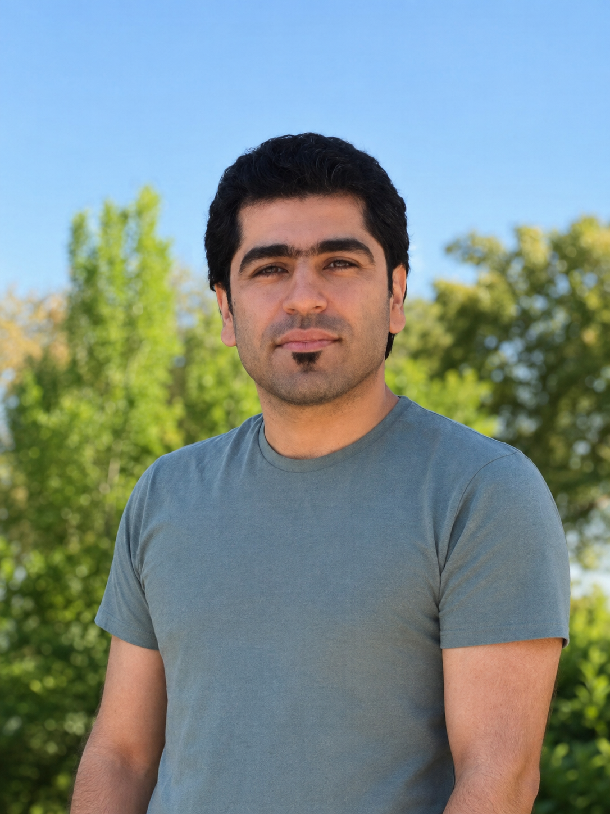

::: {.profile-page}

::: {.profile-text}

## Methodologist and Data Analyst

Dr. Hassan Pazira is a statistician and data scientist at ARQ Nationaal Psychotrauma Centrum with extensive experience in advanced statistical modelling, prediction modelling, network modelling, machine learning, federated learning, programming, real-world data analysis, and reproducible statistical reporting.

He supports research and clinical projects with data preparation, methodological consultation, (high-dimensional) longitudinal and survival data analysis, mixed-effects modelling, clinical prediction modelling, Bayesian modelling, and machine learning applications in mental health care.

His methodological interests include high-dimensional statistical learning, feature and model selection, supervised and unsupervised learning algorithms, Bayesian federated learning, and methods for analysing decentralized and multi-centre data.

**E:** h.pazira [at] arq.org

[Google Scholar](https://goo.gl/eg366y) | [LinkedIn](https://www.linkedin.com/in/hassan-pazira-82178b78/) | [GitHub](https://github.com/hassanpazira)

:::

::: {.profile-photo}

:::

:::

